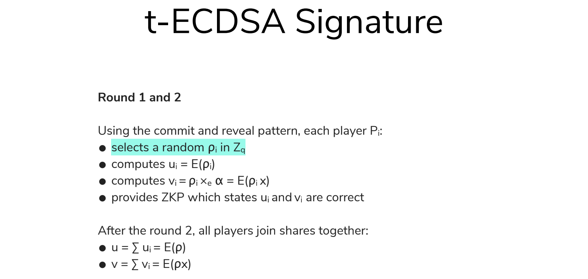
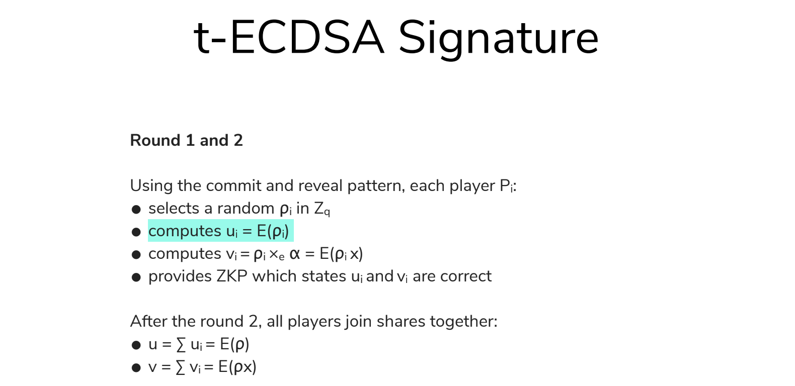
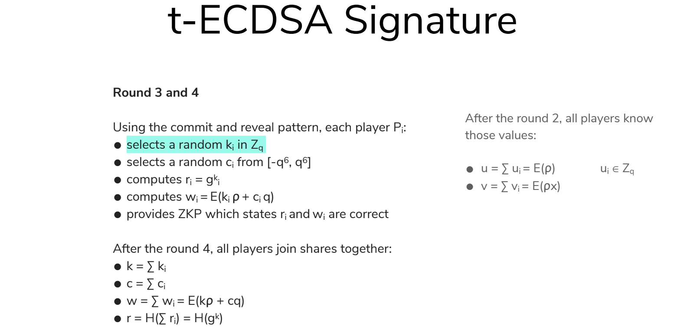
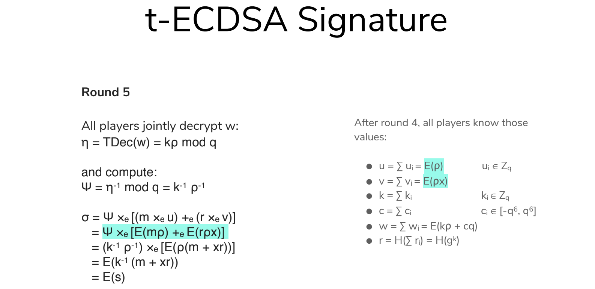
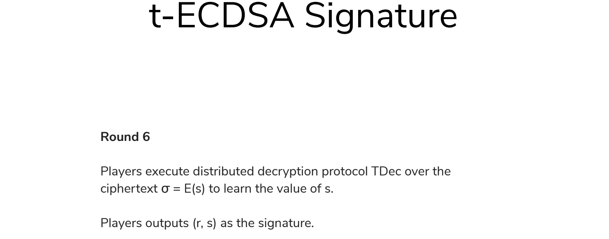

# Honey Badger Byzantine

## Videos

[https://youtu.be/jMePVYNH_Rg - Lect-34-4010-pt1-Threshold-Signatures.mp4](https://youtu.be/jMePVYNH_Rg) 
[https://youtu.be/H_MNY4ro_sM - Lect-34-4010-pt2-crypto-currencies.mp4](https://youtu.be/H_MNY4ro_sM) 

From Amazon S3 - for download (same as youtube videos)

[http://uw-s20-2015.s3.amazonaws.com/Lect-34-4010-pt1-Threshold-Signatures.mp4](http://uw-s20-2015.s3.amazonaws.com/Lect-34-4010-pt1-Threshold-Signatures.mp4) 
[http://uw-s20-2015.s3.amazonaws.com/Lect-34-4010-pt2-crypto-currencies.mp4](http://uw-s20-2015.s3.amazonaws.com/Lect-34-4010-pt2-crypto-currencies.mp4) 

## Signature

### Signature: Step 1 and 2

We have `α`, which is a t-ECDSA private key in encrypted form shared between all the signers, and we have `y` which is
a t-ECDSA public key. Public keys are just a point on the elliptic curve.

In the first round each party draws a random integer `ρ`:

Encrypt the value with additively homomorphic threshold encryption scheme:

Multiply the secret ECDSA key (`α` below) by this random value:

Use addition to implement multiplication. Each signer publishes commitment to those values, and in the second round
reveals all those values, along with the zero-knowledge proof, stating that they make sense:

Using zero-knowledge proof and the commitment we can now prove that the values we have are correct.

Join all the shares together (This means broadcast all the shares so that everybody has them):

Reveal the commitments:

### Signature: Step 3 and 4

The same commit-reveal pattern is used in the 3rd and 4th round:

On the right side we have all the parameters that were evaluated so far, and all players have the same values.

In the third round each party draws a random integer `kᵢ`:

And a random integer `cᵢ`:

`q` all the time stands for the cardinality of the elliptic curve, so the number of points on the elliptic curve.

Each party computes `rᵢ` as `g` to the power of `k` — we basically multiply curve generator point by it:

Each party computes the parameter `w` which is `k` time `ρ` plus `c` times `q`:

`q` all the time is the cardinality of the elliptic curve, and we can compute it because we use additively homomorphic
threshold encryption.

At the end, each party commits to all those parameters, and in the round 4 generated parameters are revealed, along with
the zero-knowledge proof stating that they make sense together:

Having all those parameters from all the group members we can add them together, just like we did after the round 2. We
sum up all `k` shares, all `c` shares, all `w` shares.  We evaluate parameter `r` as a sum of all `rᵢ` shares and
we use a special hash function:

This is the standard ECDSA.  `x` is a point coordinate modulo the `q` elliptic curve order.

### Signature: Step 5

All parameters on the right side are shared by all signers in the group. 

Now we need to do some discrete mathematics magic to produce a signature.
Using all those parameters we have evaluated so far, and since we operate on encrypted data, the signature will be also
encrypted.  But this is something we will deal in the final round 6.

The very first thing we need to do is that we execute a threshold decryption mechanism to have all the players decrypt
the parameter `w` and assign this value to `η`:

Compute yet one parameter called `Ψ` which is multiplicative inverse of `η` modulo `q`, and `q` is all the time
cardinality of the elliptic curve:

Having `m`, the hash of the message we are signing (or a hash of the transaction), we start evaluating the signature
with the following equation:

`c` is the value we have just evaluated, and `u`, `r` and `v` are the parameters jointly evaluated by all the signers in
previous rounds.

So, since `u` is an encrypted `ρ`, and `v` is an encrypted `ρ` multiplied by the secret ECDSA key, we can do the
following transformation:

Replace `Ψ` with the value it represents, we will get the following equation:

Eliminate ρ, we get this:

This is the equation is for the standard ECDSA signature, where `k` is the cryptographically secure random integer,
`n` is the message hash, `x` is our secret ECDSA key, and `r` is the curve generated point multiplied `k` times modulo
`q`. 

All those equations were done on ciphertexts, so at the end our signature is also encrypted:

### Signature: Step 6 - Deal with encrypted results

All the players execute a threshold decryption mechanism to learn the value of `s`. And the decrypted value `s` and
parameter `r` evaluated in round 4 together make the signature:

 
 
 
 
 
 
 
 
 
 
 
 

## What is going on with Crypto Currencies

1. Lot's of borrowing in US
2. Interest rates go up - US gov owns lots of debt
3. Devalue the Currency
4. Move value into hard assets
5. Drive up value of hard assets

 
 
 
 
 
 
 
 
 
 
